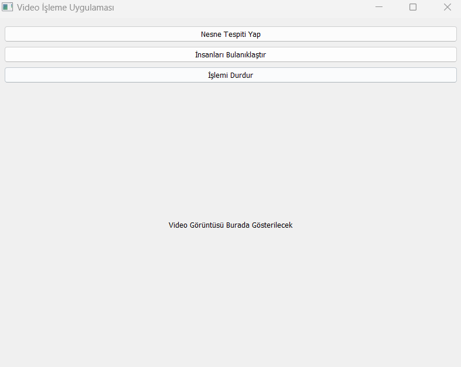
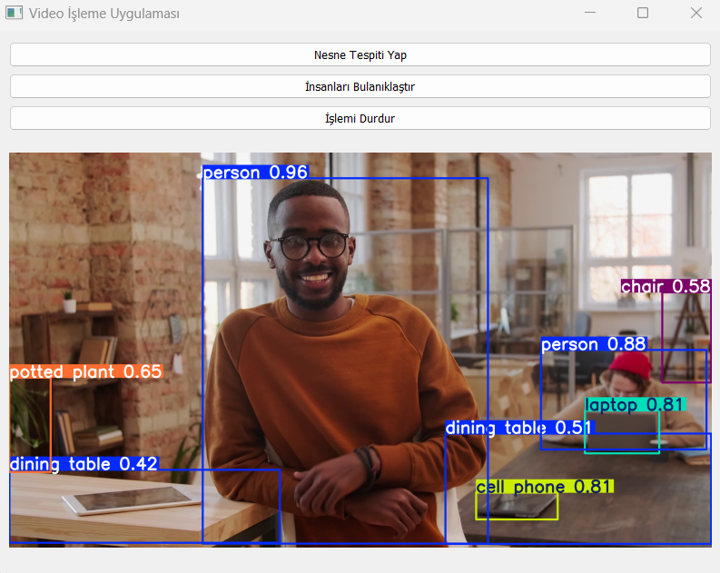
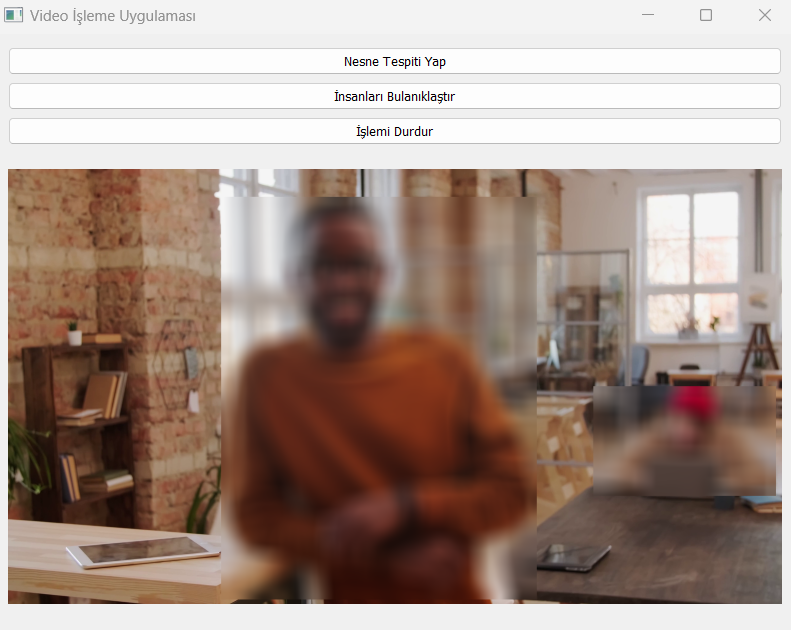

# Video İşleme Uygulaması

Bu uygulama, videolar üzerinde nesne tespiti ve insanları bulanıklaştırma işlemleri yapmanızı sağlar. YOLOv12 modelini kullanarak video akışındaki nesneleri tanıyabilir ve seçilen nesneler üzerinde işlem yapabilirsiniz.


## Ana Ekran


Bu ekran, video işlemenin yapılacağı temel arayüzü gösterir. Kullanıcı, nesne tespiti veya insanları bulanıklaştırma işlemlerini burada başlatabilir.

## Nesne Tespiti


Bu ekran, video üzerinde nesne tespiti işlemi sırasında elde edilen sonuçları gösterir. Tespit edilen nesneler çerçevelerle işaretlenir.

## İnsanları Bulanıklaştırma


İnsanları bulanıklaştırma işlemi sırasında, tespit edilen insan figürleri bulanıklaştırılır ve video üzerinde gösterilir.


## Gereksinimler

    Python 3.x
    PyQt5
    OpenCV
    ultralytics (YOLO modelini yüklemek için)


### İlk olarak temel kütüphaneleri yüklemek için aşağıdaki komutu kullanabilirsiniz:

```pip install PyQt5 opencv-python ultralytics```

### Ardından YOLOv12 modelinin bulunduğu github projesini dizinimize klonlayalım

```git clone https://github.com/sunsmarterjie/yolov12```

## Kurulum

    
1. Klonladığımız veya zip dosyası ile indirdiğiniz projenin içindeki yolov12 klasörüne girin
    
    ```cd yolov12```

2. yolov12 klasöründe video_processing_app.py dosyasının bir kopyasını yükleyelin

3. video_processing_app.py dosyasını çalıştırarak uygulamayı başlatın
    
    ```python video_processing_app.py```

## Kullanım

    Nesne Tespiti Yap butonuna tıklayarak bir video seçin ve nesne tespiti yapın.
    İnsanları Bulanıklaştır butonuna tıklayarak videodaki insanları bulanıklaştırın.
    İşlemi Durdur butonuna tıklayarak işlem sırasında herhangi bir zamanda işlemi durdurun.

## Katkıda Bulunma

    Repo'yu fork edin.
    Yeni bir branch oluşturun: git checkout -b feature/yenilik
    Yapmak istediğiniz değişiklikleri yapın ve commit'leyin.
    Değişikliklerinizi push edin: git push origin feature/yenilik
    Pull request açın.

## Lisans

Bu proje MIT Lisansı ile lisanslanmıştır.